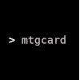

mtgcard is an offline cross-platform command-line MTG card viewer and searcher
written in python. A sqlite database is generated from a JSON database from
https://mtgjson.com/. One can update/obtain the database with `mtgcard
--update-db`. The data is updated weekly at 4PM EST, typically on Sundays, and
prices are updated daily at around 4PM EST. The download is ~45MB.

# Images

**Basic display by name**:

**Verbose display by name**:

**Detailed list search -- cards in set IKO with either (1) red instant cards
with converted mana cost >=3 OR (2) green cards with converted mana cost <3**:

**Image list search limited to a maximum of 8 results -- elf or bird creatures, that either have mutate in the text or are adventure cards**:

# Features

- display card images in plaintext
- customizable search for cards
- optionally show additional details such as price, and printings
- ANSI color
- search output in three formats: names, detailed list, and images
- all card layouts (e.g., adventure, split, meld) are supported

# Installation (Win, OSX, Linux, and other platforms)

    git clone https://github.com/yoshi1123/mtgcard.git /path/to/src
    cd /path/to/src
    pip install --no-index .

# Requirements

- Python 3.x
- certifi `pip install certifi`

# Documentation

See the man page _mtgcard_(1).

## Basic card display

    mtgcard {name}

Examples:

Show card:

    mtgcard sol ring

Show card with additional information:

    mtgcard -v sol ring

## Searching

Name listings:

    mtgcard -n {query}

Detailed, one line listings:

    mtgcard -l {query}

Card image listings:

    mtgcard -iN {query}

### Search examples

List either (1) artifact cards legal in vintage or (2) any card legal in
commander:

    mtgcard -l format:vintage type:artifact or f:commander

List images of cards in rows of four with colors red, black, or colorless,
_and_ with converted manacost 3:

    mtgcard -i4 mana<=rb cmc=3

List names of cards with colors red, black, or colorless, _or_ with converted
manacost 3:

    mtgcard -n mana<=rb or cmc=3

### Search syntax

Search for cards.

_query_ syntax:
_condition_ [[or] _condition_ ...]

A space separating _condition_ symbols implies "AND".
An "AND" has higher presedence than "OR".
For example, `mana=g cmc=1 or mana=r cmc=2` means (1) '1 green mana AND 1
converted mana cost' OR (2) '1 red mana AND 1 converted mana cost'.

_condition_ syntax:

    {keyword}{op}{value}

_keyword_ list:

    c[olors]
    cmc
    f[ormat], legal
    layout
    loyalty
    mana
    name
    power
    price
    rarity
    set
    t[ype]
    text
    toughness
    year

_op_ list: `:, =, !=, <, >, <=, >=`

### Valid mana symbols

Note: Any symbol without a '/' can be used without braces (e.g., `w` is the
same as `{W}`).

basic mana symbols:

    {W}, {U}, {B}, {R}, {G}, {C}

the numerical symbols:

    {0}, {1}, {2}, {3}, {4}, ...

the variable symbol:

    {X}

the hybrid symbols:

    {W/U}, {W/B}, {U/B}, {U/R}, {B/R}, {B/G}, {R/G}, {R/W}, {G/W}, {G/U}

the monocolored hybrid symbols:

    {2/W}, {2/U}, {2/B}, {2/R}, {2/G}

the Phyrexian mana symbols:

    {W/P}, {U/P}, {B/P}, {R/P}, {G/P}

the snow symbol:

    {S}

## Configuration

The `mtgcard/settings.py` has the following settings and default values:

Currency string:

    CURRENCY = 'USD'

Exchange rate from USD:

    US_TO_CUR_RATE = 1

Option to turn off ansi color (so one does not need to use `-g`):

    ANSI_COLOR = True

# Notes

Database from https://mtgjson.com/
